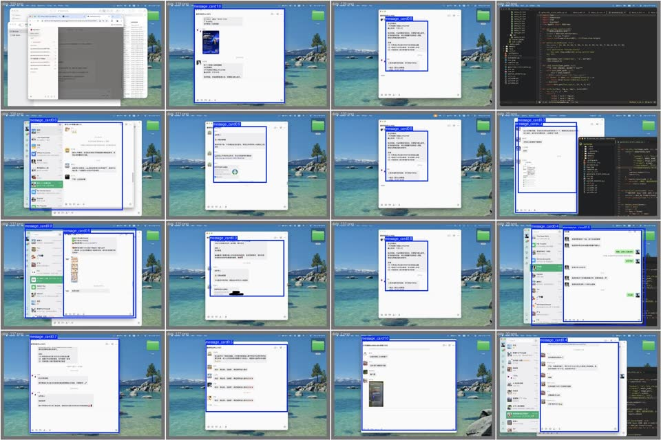

# nvision 💬👁️

微信消息视觉监控工具。自动截屏微信窗口 → YOLO 检测消息卡片 → OCR 提取文字 → 关键词匹配触发动作，实现微信消息的无人值守监控。

## 功能概览

| 模块 | 说明 |
|------|------|
| **微信截屏** | macOS 桌面切换 + 定时截取微信窗口 + ffmpeg 缩放 |
| **消息卡片检测** | YOLO 识别微信聊天中的消息卡片/气泡 |
| **OCR 文字提取** | RapidOCR 对消息卡片裁剪图提取全文 |
| **关键词监控** | 正则匹配 OCR 结果，命中后触发通知/自动操作 |
| **数据存储** | DuckDB 持久化截图/检测/OCR 全链路数据 |
| **VLM 自动标注** | MLX LocateAnything 自动标注微信截图，生成 YOLO 训练集 |
| **GUI 自动化** | pyautogui + AppleScript 自动发朋友圈、回复消息等 |

## 快速开始

### 环境要求

- macOS (Apple Silicon 推荐)
- Python 3.10+
- [Ultralytics](https://github.com/ultralytics/ultralytics) YOLO
- [RapidOCR](https://github.com/RapidAI/RapidOCR) (onnxruntime)
- DuckDB, pyautogui, pyperclip, Pillow
- ffmpeg, MLX VLM (可选，用于自动标注)

### 安装

```bash
git clone https://github.com/yourname/nvision.git
cd nvision
python -m venv .venv
source .venv/bin/activate
pip install ultralytics rapidocr_onnxruntime duckdb pyautogui pyperclip pillow
```

## 项目结构

```
nvision/
├── capture.py              # 基础截图：桌面切换 + 截屏 + 缩放
├── capture_and_detect.py   # 完整流程：截图 → YOLO 推理 → 裁剪 → OCR → 入库
├── yolo.py                 # YOLO 训练 / 验证 / 推理
├── generate_train_data.py  # VLM 自动标注 → YOLO 数据集
├── db.py                   # DuckDB 数据库管理
├── monitor_gym.py          # 关键词监控示例（健身房排期通知）
├── automate.py             # GUI 自动化：坐标映射 + 点击 + 文本输入
├── wechat_moments.py       # 微信朋友圈自动发布
├── pic.py                  # VLM 单图识别 + 标注
├── captureloop.sh          # 循环监控脚本（截图+检测+OCR+关键词匹配）
├── run.sh                  # 压力测试脚本
└── dataset/                # 训练数据（gitignore，需自行准备）
    ├── data.yaml
    ├── images/{train,val}/
    └── labels/{train,val}/
```

## 使用方法

### 1. 微信消息监控（一次性检测）

```bash
python capture_and_detect.py \
    --model best.pt \
    --desktop 2 \
    --return-desktop 3
```

仓库自带训练好的 `best.pt` 模型，可自动识别微信聊天中的消息卡片，将卡片区域裁剪为独立图片，再用 RapidOCR 提取卡片中的文字内容。全链路效果：

```
微信窗口截图 → YOLO 检测消息卡片 → 裁剪出每张卡片 → OCR 提取文字
```

无需自行训练即可使用。



参数说明：

| 参数 | 默认值 | 说明 |
|------|--------|------|
| `--model` | 必填 | YOLO 权重路径 |
| `--desktop` | 2 | 截图的 macOS 桌面编号 (1-9) |
| `--return-desktop` | None | 截图后切回的桌面 |
| `--conf` | 0.25 | 检测置信度阈值 |
| `--skip-ocr` | false | 跳过 OCR 步骤 |
| `--query` | false | 查询历史 OCR 结果 |

### 2. 查询历史数据

```bash
python capture_and_detect.py --query --limit 20
```

### 3. 训练自定义 YOLO 模型

先用 VLM 自动标注生成数据集：

```bash
python generate_train_data.py --input wechat/raw_screenshots --output dataset --val-ratio 0.1
```

然后训练：

```bash
python yolo.py --data dataset/data.yaml --epochs 100
```

训练参数针对 UI 自动化做了优化（关闭马赛克增强、翻转、色相抖动等不适合 UI 场景的增强）。

### 4. 循环监控微信消息

```bash
# 编辑 example_loop.sh 配置模型路径和桌面编号
bash example_loop.sh
```

脚本会循环执行：截取微信窗口 → 检测消息卡片 → OCR → 关键词匹配 → 命中时触发动作（通知、自动回复、发送邮件等）。

### 5. 微信自动化操作

```bash
# 自动发朋友圈
python wechat_moments.py -t "发布内容" -i /path/to/image.jpg -d 2

# 基于坐标的点击输入（自动回复消息等）
python automate.py
```

## 数据库

DuckDB 存储全链路数据，三张表关联：

```
screenshots ──1:N──> detections ──1:N──> ocr_results
```

Python API 查询示例：

```python
import db

# 最近 10 条 OCR 结果
results = db.query_recent_data(limit=10)
for r in results:
    print(f"[{r['timestamp']}] {r['full_text']}")
```

## 权限

macOS 需要授予以下权限：

- **屏幕录制**：系统偏好设置 → 隐私与安全性 → 屏幕录制 → 勾选终端
- **辅助功能**：系统偏好设置 → 隐私与安全性 → 辅助功能 → 勾选终端

## License

MIT
